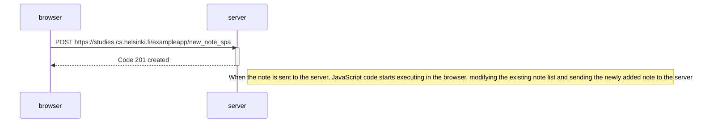

```mermaid
  sequenceDiagram
      participant browser
      participant server

      browser->>server: POST https://studies.cs.helsinki.fi/exampleapp/new_note_spa
      activate server
      server-->>browser: Code 201 created
      deactivate server

      Note right of server: When the note is sent to the server, JavaScript code starts executing in the browser, modifying the existing note list and sending the newly added note to the server

```